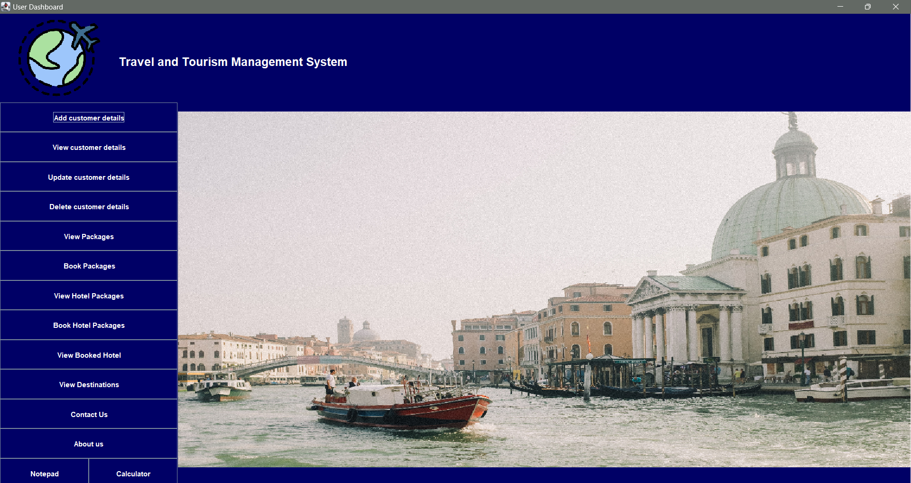

# Tourism Data Management Application 

## Description
This data management application is designed for a Sample Tourism company allowing the users to register, sign in and book their chosen vacation or holiday packages, hotels, and activities. 
It also allows the admin to add new packages, hotels and activities to the database. This application is written in Java and used the Java Swing library for the UI and MongoDB as a database.
## Getting Started
### Prerequisites
You need to have Java installed and configured on your machine.  
### Installation
Run the below commands on your terminal
Start by cloning the repo
```
https://github.com/Samrath-SinghSaini/TourismManagementApp.git
```
cd into the installed folder, open the project in an IDE of your choice like intelliJ and run the dashboard file. You should see the GUI open in a new window. 
```
cd TourismManagementApp
```
## Features 
1. Login/Register using MySQL/MongoDB and JDBC. 
2. Ability to add, read, update, delete customers, packages, hotels and destinations.

## Screenshots

